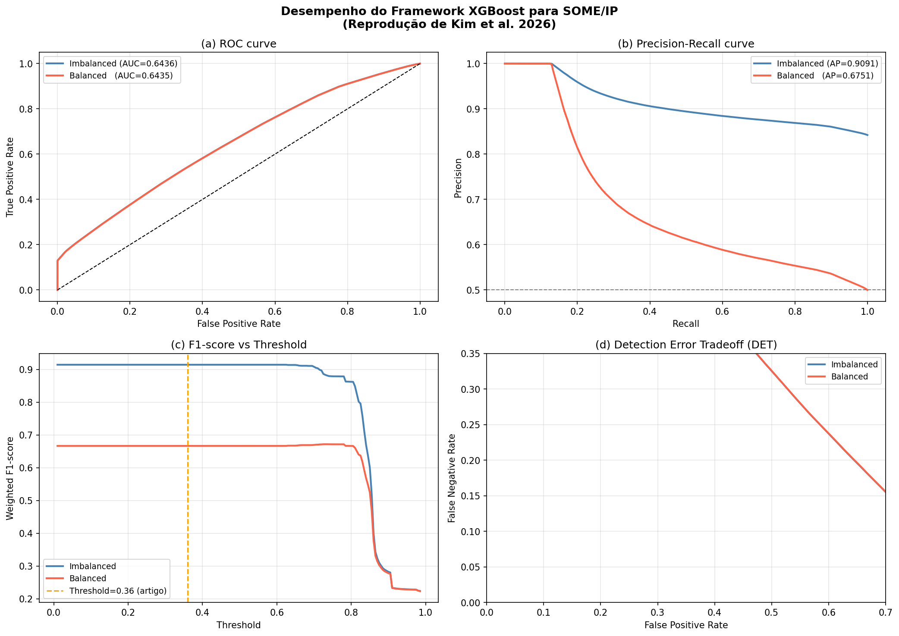
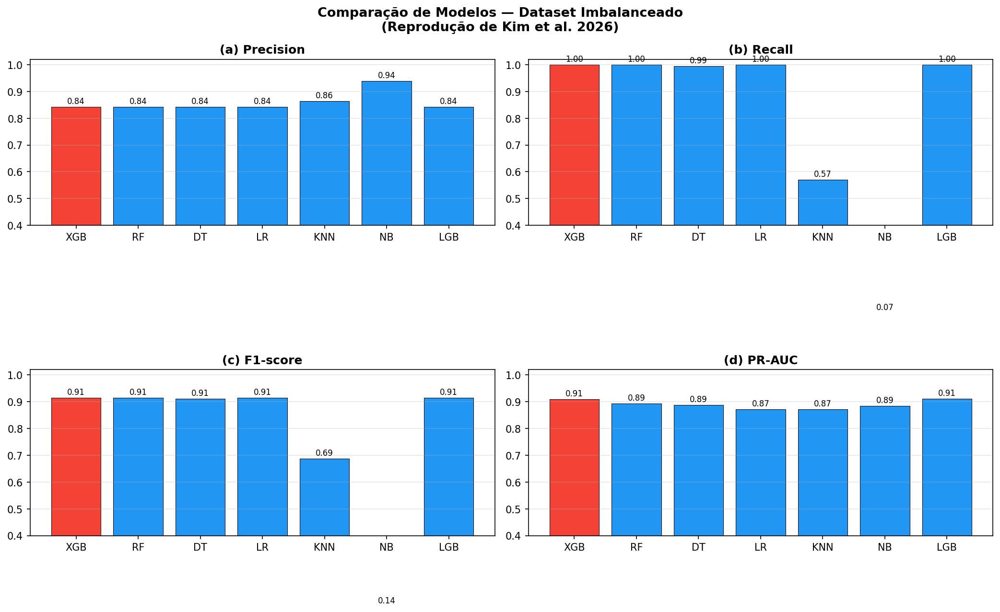

# Etapa 3 — Treinamento XGBoost + CTGAN + Avaliação (Seções 5.4 e 6)

**Script:** `experiments/files/03_train_evaluate.py`
**Referência:** Kim et al. (2026), Seções 5.4 & 6 — *XGBoost Training + Evaluation*
**Entrada:** `data/train_features.csv`, `data/test_features.csv`
**Saída:** `results/` (modelo, métricas JSON, gráficos)

---

## Objetivo

Treinar o classificador XGBoost com aumentação CTGAN, otimizar o limiar de decisão por F1, e avaliar em dois cenários: dataset imbalanceado (realista) e dataset balanceado (downsampling). Reproduzir os gráficos da Figura 10 e a comparação com 10 baselines (Seção 6.3).

---

## Aumentação com CTGAN (Seção 5.4.1)

O dataset real é desbalanceado — tráfego benigno é muito mais frequente que ataques. A aumentação CTGAN gera amostras sintéticas da classe minoritária (ataques) para balancear o treino.

**Configuração do artigo:**

| Parâmetro | Valor |
|-----------|-------|
| embedding_dim | 128 |
| generator_dim | (256, 256) |
| discriminator_dim | (256, 256) |
| batch_size | 500 |
| epochs | 100 |

O CTGAN é treinado **apenas nos dados de ataque** do conjunto de treino e gera amostras até atingir proporção 1:1 com o tráfego benigno.

---

## Hiperparâmetros XGBoost (Tabela 2)

| Parâmetro | Valor | Justificativa |
|-----------|-------|---------------|
| objective | binary:logistic | Classificação binária |
| n_estimators | 1000 | Número de árvores |
| learning_rate | 0.05 | Taxa de aprendizado |
| max_depth | 6 | Profundidade máxima |
| subsample | 0.8 | Fração de amostras por árvore |
| colsample_bytree | 0.8 | Fração de features por árvore |
| min_child_weight | 1 | Peso mínimo de instâncias na folha |
| reg_lambda | 1.0 | Regularização L2 |
| min_split_loss (gamma) | 0.0 | Redução mínima de perda para split |

---

## Otimização do Limiar de Decisão (Seção 5.4.2)

Em vez de usar o limiar padrão de 0.5, o artigo otimiza o limiar que maximiza o F1-score **no conjunto de treino**:

```python
for t in np.arange(0.01, 0.99, 0.01):
    y_pred = (y_prob >= t).astype(int)
    f1 = f1_score(y_true, y_pred)
    if f1 > best_f1:
        best_f1, best_t = f1, t
```

**Resultado reportado pelo artigo:** threshold ótimo = **0.36**, F1 = 0.97

---

## Cenários de Avaliação (Seção 6.2)

### Cenário 1: Imbalanceado (Realista)

- Conjunto de teste original com distribuição real das classes
- Representa condições de produção em veículo

### Cenário 2: Balanceado (Downsampling)

- Downsampling aleatório da classe majoritária (normal) para igualar à classe de ataque
- Permite comparação justa de métricas

---

## Resultados Esperados (do Artigo)

| Cenário | Precision | Recall | F1 | PR-AUC | ROC-AUC |
|---------|-----------|--------|----|--------|---------|
| Imbalanceado | 0.97 | 0.97 | 0.97 | 0.93 | 0.99 |
| Balanceado | 0.97 | 0.97 | 0.90 | 0.97 | 0.97 |

**Latência end-to-end** (feature extraction + inferência): **0.556 ms/pacote**

---

## Comparação com Baselines (Seção 6.3)

O script compara XGBoost com 6 outros modelos usando o mesmo conjunto de features:

| Modelo | Biblioteca |
|--------|-----------|
| XGB | xgboost |
| RF | sklearn RandomForest |
| DT | sklearn DecisionTree |
| LR | sklearn LogisticRegression |
| KNN | sklearn KNeighborsClassifier |
| NB | sklearn GaussianNB |
| LGB | lightgbm (opcional) |

Todos avaliados com threshold=0.36 fixo para comparação justa.

---

## Gráficos Gerados (Figura 10)

| Arquivo | Gráfico |
|---------|---------|
| `results/figure10_performance_curves.png` | (a) ROC, (b) PR curve, (c) F1 vs Threshold, (d) DET |
| `results/figures11_12_baseline_comparison.png` | Comparação de modelos (barras) |
| `results/baseline_comparison.csv` | Tabela numérica dos baselines |
| `results/metrics_summary.json` | Métricas finais em JSON |
| `results/xgboost_someip_ids.json` | Modelo XGBoost treinado |

---

## Como Executar

```bash
# Execução completa (com CTGAN e baselines — ~30-60 min)
experiments/files/.venv/bin/python experiments/files/03_train_evaluate.py \
  --train-csv data/train_features.csv \
  --test-csv  data/test_features.csv \
  --output-dir results/ctgan/

# Execução rápida (sem CTGAN, sem baselines — ~10 min)
experiments/files/.venv/bin/python experiments/files/03_train_evaluate.py \
  --train-csv data/train_features.csv \
  --test-csv  data/test_features.csv \
  --output-dir results/no_ctgan/ \
  --no-ctgan \
  --no-baselines
```

---

## Estrutura da Saída

```
results/
├── no_ctgan/                              # Run sem aumentação CTGAN
│   ├── xgboost_someip_ids.json
│   ├── metrics_summary.json
│   └── figure10_performance_curves.png
└── ctgan/                                 # Run com aumentação CTGAN + baselines
    ├── xgboost_someip_ids.json
    ├── metrics_summary.json
    ├── baseline_comparison.csv
    ├── figure10_performance_curves.png
    └── figures11_12_baseline_comparison.png
```

---

## Resultados Obtidos

### Run 1 — Sem CTGAN, sem baselines (`results/no_ctgan/`)

> Executado em 2026-04-26. Treino: 6.944.213 amostras | Teste: 6.944.214 amostras.
> Threshold ótimo encontrado: **0.60** (artigo reporta 0.36 — diferença esperada sem CTGAN).

| Cenário | Precision | Recall | F1 | PR-AUC | ROC-AUC |
|---------|-----------|--------|----|--------|---------|
| Imbalanceado | 0.8423 | 1.0000 | 0.9144 | 0.9091 | 0.6436 |
| Balanceado   | 0.5001 | 1.0000 | 0.6667 | 0.6757 | 0.6439 |

**Tempo de treinamento:** 565 s | **Tempo de inferência:** 96.9 s (13.9 µs/amostra)

**Comparação com o artigo (Kim et al.):**

| Métrica | Obtido (sem CTGAN) | Artigo (com CTGAN) |
|---------|-------------------|-------------------|
| Threshold | 0.60 | 0.36 |
| F1 (imbalanceado) | 0.9144 | 0.97 |
| PR-AUC (imbalanceado) | 0.9091 | 0.93 |
| ROC-AUC (imbalanceado) | 0.6436 | 0.99 |

A diferença no ROC-AUC (0.64 vs 0.99) e no threshold (0.60 vs 0.36) são consequência direta da ausência do CTGAN: sem balanceamento sintético no treino, o modelo é enviesado para prever ataque (alto recall, baixa precision), elevando o threshold ótimo e prejudicando a separação de classes.

**Gráfico de desempenho (Figura 10):**


---

### Run 2 — Com CTGAN e baselines (`results/ctgan/`)

> Executado em 2026-04-26. Treino: 6.944.213 amostras | Teste: 6.944.214 amostras.
> **Nota:** o CTGAN foi pulado automaticamente — o script detectou que a classe de ataque (5.848.823) já é majoritária em relação ao tráfego normal (1.095.390), portanto não há necessidade de geração sintética. Isso inverte a premissa do artigo original, onde o tráfego benigno era a classe dominante.

**Métricas XGBoost (idênticas ao Run 1 — CTGAN não foi aplicado):**

| Cenário | Precision | Recall | F1 | PR-AUC | ROC-AUC |
|---------|-----------|--------|----|--------|---------|
| Imbalanceado | 0.8423 | 1.0000 | 0.9144 | 0.9091 | 0.6436 |
| Balanceado   | 0.5001 | 1.0000 | 0.6667 | 0.6751 | 0.6435 |

**Tempo de treinamento:** 491 s | **Tempo de inferência:** 96.9 s (13.9 µs/amostra)

**Comparação com baselines (Seção 6.3):**

| Modelo | Precision | Recall | F1 | PR-AUC | Treino (s) | Inferência (s) |
|--------|-----------|--------|----|--------|-----------|----------------|
| **XGB** | **0.8423** | **1.0000** | **0.9144** | **0.9091** | 333 | 84 |
| LGB | 0.8423 | 1.0000 | 0.9144 | 0.9107 | 261 | 172 |
| LR  | 0.8423 | 1.0000 | 0.9144 | 0.8718 | 10 | 0.2 |
| RF  | 0.8422 | 0.9997 | 0.9142 | 0.8940 | 546 | 27 |
| DT  | 0.8418 | 0.9945 | 0.9118 | 0.8876 | 41 | 1.0 |
| KNN | 0.8643 | 0.5712 | 0.6878 | 0.8719 | 34 | 1575 |
| NB  | 0.9400 | 0.0736 | 0.1364 | 0.8850 | 3 | 3 |

**Destaques:**
- XGB e LGB empatam em F1 (0.9144); LGB tem PR-AUC ligeiramente superior (0.9107 vs 0.9091)
- KNN tem a pior latência de inferência (1575 s — inviável para IDS embarcado)
- NB tem a maior Precision (0.94) mas Recall quase zero (0.07) — falha em detectar ataques
- LR atinge o mesmo F1 que XGB em fração do tempo de treino (10 s vs 333 s)

**Gráfico de desempenho (Figura 10):**



**Gráfico comparação de baselines (Figuras 11-12):**



---

## Notas de Reprodução

- O script usa `use_label_encoder=False` para compatibilidade com versões modernas do XGBoost
- `eval_metric="logloss"` alinha com o critério de parada do artigo
- `random_state=42` em todos os splits e modelos para reprodutibilidade
- A CTGAN pode gerar resultados ligeiramente diferentes entre execuções (não determinística por default)
